# Signal Simulation Engine R&D — Handoff

**Snapshot date:** 2026-09-01  
**Repository:** `C:\Users\Clarissa\Documents\Code\clean-primary\gbdt-rnd`  
**Branch:** `master`  
**Git state:** repository has no commits yet; all project files are currently untracked  
**Future consumer:** `C:\Users\Clarissa\Documents\Code\clean-primary\Mono-icarus`

## 1. Executive summary

This repository is an end-to-end R&D implementation for testing whether
longitudinal company signals and signal sequences can surface timely,
evidence-backed prospects for a specific product and ICP.

The first product fixture is
[Sidekick](https://textside.com/), an SMS-based assistant for frontline
manufacturing operations, work-order routing, training, maintenance history,
and preserving tribal knowledge.

The system currently provides:

- public-data acquisition with content-hashed manifests;
- source-anchored, point-in-time normalized events;
- per-signal-instance FactSheets and deterministic signal StoryCards;
- configurable signal definitions for four temporal data shapes;
- ICP/product/goal-conditioned account features;
- cross-signal sequence features;
- heuristic, calibrated LightGBM, and local TabPFN models;
- point-in-time/account-holdout benchmarks;
- signal portfolio weight proposals;
- cached, evidence-constrained OpenAI account StoryCards;
- durable DuckDB experiment runs and resumable SSE events;
- a Next.js experiment observatory with chat-like run control, model results,
  recommendations, account evidence, and timelines;
- strict JSON Schema contracts intended to transfer to Mono-icarus.

The current public manufacturing data can produce **human-review candidates**.
It cannot produce a trustworthy Sidekick purchase probability or contact-time
decision because no Sidekick outreach/reply/meeting labels exist.

## 2. Current product and ICP fixture

The versioned fixture lives in
[`configs/side-manufacturing.yaml`](../configs/side-manufacturing.yaml).

Product:

- Name: Sidekick
- Version: `sidekick-v1`
- Website: `https://textside.com/`
- Primary capabilities:
  - frontline SMS assistant;
  - work-order creation and routing;
  - searchable plant history;
  - SOP/manual retrieval;
  - frontline training.

ICP:

- Version: `sidekick-manufacturing-v1`
- US manufacturing NAICS prefixes `31`, `32`, and `33`
- Employee hypothesis: 20–5,000
- Operational traits:
  - deskless frontline workforce;
  - asset-intensive facilities;
  - repeatable maintenance processes;
  - knowledge concentrated among experienced workers.
- Buyer-title hypotheses:
  - Plant Manager;
  - VP Operations;
  - Maintenance Director;
  - EHS Director.

Goal:

- Version: `frontline-knowledge-v1`
- Rank manufacturers whose trajectories suggest growing need for knowledge
  capture, training, maintenance, or work-order coordination.

## 3. Architecture

```mermaid
flowchart LR
  sourceData[Public source bytes] --> manifest[Frozen checksum manifest]
  manifest --> normalizer[Source adapters]
  normalizer --> eventStore[Point-in-time event store]
  eventStore --> factSheets[Signal-instance FactSheets]
  factSheets --> signalStories[Deterministic signal StoryCards]
  eventStore --> accountState[ICP-conditioned account state]
  factSheets --> accountState
  accountState --> sequenceFeatures[Cross-signal sequence features]
  sequenceFeatures --> scorers[Heuristic, LightGBM, TabPFN]
  scorers --> separatedScores[Separated score components]
  separatedScores --> reviewPolicy[Human-review policy]
  reviewPolicy --> accountStories[Bounded account StoryCards]
  accountStories --> api[FastAPI and SSE]
  api --> web[Next.js observatory]
  api -. future contract .-> icarus[Mono-icarus worker]
```



### World evidence versus customer meaning

World events and FactSheets are customer-independent. Product, ICP, goal, and
signal policy are versioned run inputs.

The same OSHA observation can therefore be:

- useful evidence for Sidekick;
- neutral for a lender;
- more important for a safety-compliance product.

The source fact does not change. Its relevance changes with the product/ICP.

### Four signal shapes

New signals declare one of:

- `numeric_series` — employee counts, injuries, production;
- `state_machine` — loan/permit/contract lifecycle;
- `event_burst` — awards, engagement, news/review bursts;
- `document_versions` — job postings, requirements, public-document changes.

Signal declarations are under [`signals/`](../signals/). The implementation and
required tests are documented in
[`docs/signal-creation.md`](signal-creation.md).

## 4. Current score semantics

Engine version `signal-engine-0.2.0` stopped averaging incompatible model
outputs.

Each recommendation now carries separate values:

- `icp_fit_score` — how well the account satisfies the configured ICP;
- `signal_relevance_score` — hand-configured Sidekick signal hypothesis;
- `proxy_event_score` — LightGBM/TabPFN estimate for the current research
  target;
- `data_confidence_score` — observed-versus-missing source coverage;
- `model_disagreement` — whether model outputs differ materially;
- `decision_status` — actionable, human review, insufficient evidence, or
  research only.

For public SBA/OSHA runs:

- the proxy target is a future public event, not a purchase or reply;
- action is `review`;
- contact timing and dollar EV are disabled;
- strong heuristic/learned-model disagreement produces an explicit warning.

Action simulation is enabled only for `real_outcome` labels. It requires models
trained on real reply/meeting/purchase outcomes rather than public-event
proxies.

## 5. Manufacturing data

The authoritative local manifest is
[`data/manifests/public-sidekick-v1.json`](../data/manifests/public-sidekick-v1.json).

Downloaded official sources:

- SBA 504, FY2010–present;
- SBA 7(a), FY2020–present;
- OSHA ITA annual establishment summaries for 2023, 2024, and 2025.

Normalized corpus:

- 130,226 manufacturing accounts;
- 264,804 normalized events;
- 55,048 accounts with multiple OSHA reporting years;
- 1,245 conservatively linked accounts with both SBA and OSHA signal families.

Raw bytes and DuckDB files are intentionally gitignored.

### Current manufacturing features

SBA:

- approved, disbursed, paid-in-full, and charged-off lifecycle stages;
- loan amount;
- jobs supported;
- term length;
- source latency;
- stage transitions;
- recency and stage-aware decay.

OSHA:

- annual employees;
- total recordable cases;
- days-away cases;
- latest, max, mean, delta, and slope;
- recency;
- multiple-year trajectory.

Configured sequence hypotheses:

- financing followed by operational pressure;
- production growth followed by safety pressure;
- contract award followed by frontline hiring.

Only the first is currently observable from the downloaded SBA/OSHA corpus.
EPA, USAspending, and job-posting sources are declared but not populated.

### Identity constraints

Cross-source account linkage requires normalized legal name, city, state, and
five-digit ZIP agreement. Legal suffixes and punctuation are ignored. Fuzzy
name-only merges are forbidden.

This is deliberately precision-first: it prevents combining signals from
different companies but sacrifices match recall.

The SBA files do not expose a documented native loan-number column. The adapter
preserves `LocationID` and derives a reproducible source-row anchor. Every event
records `loan_id_is_source_native=false`.

### Source-time constraints

Every event retains:

- `occurred_at`;
- `delivered_at`;
- `ingested_at`;
- `available_at`.

Backtests use `available_at`. Some historical publication timestamps are
estimated because the current public bulk files do not provide every historical
release snapshot.

### EPA status

The official national TRI CSV endpoint returned HTTP 500 for both 2023 and 2024.
The failure is recorded in
[`data/manifests/epa-tri-2024.failure.json`](../data/manifests/epa-tri-2024.failure.json).
No scraped or guessed replacement was used.

## 6. Real outcome datasets

These outcome datasets validate different engine layers but cannot be joined to
SBA/OSHA because their identities are anonymized.

### Olist Marketing Funnel

Report:
[`data/manifests/olist-outcome-benchmark-v1.json`](../data/manifests/olist-outcome-benchmark-v1.json)

- 8,000 real anonymized marketing-qualified leads;
- 842 closed deals;
- 10.5% overall win rate;
- average close duration: 48.4 days.

Leakage-safe features:

- acquisition origin;
- landing-page bucket;
- first-contact month, weekday, and cyclical year position.

Closed-deal-only fields are labels and never features.

Results (laptop profile, `olist-outcome-benchmark-v1.json`, LightGBM with
the 2026-09-01 calibration fix in §7):

- LightGBM: PR-AUC 18.1%, ROC-AUC 58.7%, precision@100 23% (58.1% before the
  fix);
- TabPFN (600 rows): PR-AUC 18.3%, ROC-AUC 62.2%, precision@100 20%;
- constant test baseline PR-AUC: approximately 13.7%.

GPU profile (`olist-outcome-benchmark-gpu-v1.json`, TabPFN on all 2,842
training rows, 8 estimators, A100 40 GB; its LightGBM row predates the
calibration fix):

- LightGBM: 58.1%, identical to the pre-fix laptop run, confirming the split
  did not change;
- TabPFN: PR-AUC 20.8%, ROC-AUC 63.2%, precision@100 23%.

Interpretation:

- both models find modest real signal;
- TabPFN ranks the whole set better and, with full context, matches LightGBM
  at the top-100 cutoff;
- the pre-close data is too sparse to expect strong prediction.

### UCI Bank Marketing

Report:
[`data/manifests/uci-bank-outcome-benchmark-v1.json`](../data/manifests/uci-bank-outcome-benchmark-v1.json)

- 41,188 real direct-marketing contacts;
- 4,640 subscriptions;
- 11.3% overall response rate.

Leakage-safe features:

- customer demographics and credit state;
- contact channel and calendar;
- current campaign contact count;
- days since previous contact;
- previous contact count and outcome;
- public macroeconomic context.

Call duration is excluded because it is known only after the call.

Results (laptop profile, `uci-bank-outcome-benchmark-v1.json`, LightGBM with
the 2026-09-01 calibration fix in §7):

- LightGBM: PR-AUC 35.3%, ROC-AUC 63.8%, precision@250 45.6% (was 25.2% /
  53.7% / 23.2% with the old 80/20 time holdout — see §13 item 8a);
- TabPFN (600 rows): PR-AUC 29.0%, ROC-AUC 60.4%, precision@250 25.2%;
- later-period test prevalence: approximately 23.8%.

GPU profile (`uci-bank-outcome-benchmark-gpu-v1.json`, TabPFN on all 22,103
training rows, 8 estimators, A100 40 GB, 4.5 s inference; LightGBM row
predates the fix):

- LightGBM: 53.7% (pre-fix configuration);
- TabPFN: PR-AUC 45.3%, ROC-AUC 75.8%, precision@250 52.0%, Brier 0.199.

Interpretation:

- the 600-row CPU cap, not the chronological split alone, explained most of
  the gap to published numbers: full-context TabPFN on this harder split lands
  inside the public range (LR 75.5% / tuned GB 80.4% ROC-AUC on random splits);
- the old LightGBM 53.7% was an inverted model (raw 0.463) flipped by a Platt
  calibrator fitted on the newest slice; with expanding-window calibration it
  reaches 63.8%, still 12 points below full-context TabPFN under the same
  drift, and the same features score 80% under a random split — the
  protocol, not the features, is the difference;
- probability calibration remains poor for both in this time-shifted split;
- exact client IDs and exact years are unavailable, limiting grouped/time
  evaluation.

The constant heuristic's high precision@K is a tie-order artifact and must not
be interpreted as predictive performance.

### Hillstrom Email Experiment

Report:
[`data/manifests/hillstrom-uplift-benchmark-v1.json`](../data/manifests/hillstrom-uplift-benchmark-v1.json)

- 64,000 customers;
- 42,694 received an email;
- 21,306 control/no-email customers;
- 578 conversions;
- randomized treatment assignment.

Pre-treatment features:

- purchase recency;
- historical spend and spend segment;
- previous men's/women's merchandise purchase;
- new-versus-established status;
- ZIP group;
- previous purchase channel.

Observed test effect:

- no email conversion: 0.597%;
- email conversion: 1.165%;
- absolute treatment effect: +0.568 percentage points.

Current T-learner results (laptop profile; LightGBM with the 2026-09-01
calibration fix — the pre-fix configuration gave +0.755 pp / IPW 1.199% /
93.7% contact share):

- LightGBM top-20% observed uplift: +0.580 percentage points;
- LightGBM IPW policy conversion: approximately 1.2%;
- LightGBM recommends contact for most customers, so its gain over contact-all
  is small;
- TabPFN (600 rows) top-20% observed uplift: -0.734 percentage points;
- TabPFN (600 rows) IPW policy conversion: 1.012%, below contact-all.

GPU profile (`hillstrom-uplift-benchmark-gpu-v1.json`, TabPFN on all 34,158
treated and 17,020 control training rows, no OOM on 40 GB):

- LightGBM: identical (+0.755 pp);
- TabPFN top-20% observed uplift: +0.900 pp (treated 2.045% vs control
  1.145% in the selected fifth; test ATE is +0.568 pp);
- TabPFN predicts positive uplift for every test customer, so its policy is
  contact-all (IPW 1.161% ≈ observed contact-all 1.165%).

Interpretation:

- the negative TabPFN uplift was a 600-row artifact; with full context TabPFN
  edges out LightGBM on top-20% uplift;
- neither learner produces a policy that beats contact-all, which is expected
  for a positive-ATE email campaign;
- the current two-model T-learner is not the final causal benchmark;
- Qini, AUUC, repeated seeds, bootstrap intervals, S/X/R/DR learners, and
  Causal Forest remain to be added.

## 7. Current model configuration

### LightGBM

- 250 estimators;
- learning rate 0.04;
- balanced class weights;
- Platt calibration fitted on expanding-window out-of-fold predictions (three
  time folds), rejected whenever its slope is non-positive, then a final fit on
  every training row (changed 2026-09-01; the previous 80/20 time holdout
  inverted on UCI — §13 item 8a). `calibration="holdout"` and `"none"` remain
  available for ablations;
- native contribution output used for model factors;
- model and metadata artifacts persisted under gitignored `artifacts/`.

### TabPFN

- installed package: `tabpfn>=8.5.0` (v3 default checkpoint);
- runtime model ID: `tabpfn-local-v2`;
- license accepted and local model weights downloaded;
- execution is now a named profile recorded in every benchmark report
  (`executionProfile`, `hardware`, `modelRuntimes`):
  - `laptop` — 600 training rows, two estimators, CPU (all numbers in §6);
  - `gpu` — full point-in-time training partition capped at 50,000 rows, eight
    estimators, CUDA, `ignore_pretraining_limits=True`; on CUDA out-of-memory
    the context is halved (floor 4,000 rows) and every attempt is recorded.
- LightGBM stays on CPU in both profiles.

The laptop profile is a practical local setting, not a full-strength algorithm
comparison. The GPU profile runs through the Lambda runner
([`docs/lambda-gpu-runner.md`](lambda-gpu-runner.md)) and writes
`data/manifests/*-gpu-v1.json` next to the laptop reports. The first GPU run
(job `20260901T011845Z-157c13`, A100 40 GB, ~7 min, ≈$0.22) completed on
2026-09-01; its numbers are in §6.

### OpenAI StoryCards

- account narration is optional and runs only for shortlisted accounts;
- current API caps LLM narration at five accounts per run;
- StoryCards are cached by account state, product/ICP version, and provider;
- unsupported evidence or invalid structured output falls back to a
  deterministic StoryCard;
- LLM prose never performs numeric calculation or determines universe ranking.

Signal StoryCards and FactSheets exist, but StoryCard semantic fields are not
currently model features. Their incremental value must be tested through
ablation before promotion into scoring.

## 8. Experiment harness and UI

Backend:

- FastAPI on port `8100`;
- DuckDB run/event/recommendation/benchmark/StoryCard authority;
- dense append-only per-run event sequence;
- resumable SSE stream;
- interrupted running jobs reconcile to `indeterminate`;
- model execution is offloaded from the API event loop.

Frontend:

- Next.js production/dev server on port `3100`;
- same-origin proxy under `/api/engine`;
- chat-like typed experiment request;
- run ledger and model benchmarks;
- real company names, NAICS, and state;
- account StoryCard and source-backed signal timeline;
- separated score breakdown;
- model disagreement warning;
- PREV/NEXT switching with neighboring account prefetch;
- narrow-screen drawer with background scroll lock;
- stable loading state instead of collapsing the timeline.

Indexed account lookup replaced a full 130,226-account scan and measured
approximately 0.1 seconds directly, around 0.3 seconds through the full response
path.

The Next.js dev server became unresponsive after long sessions. For stable
manual testing, prefer the production build/start commands below.

## 9. Run locally

Install:

```powershell
uv sync --all-extras --dev
pnpm install
```

Fixture-mode API:

```powershell
pnpm dev:api
```

Real public manufacturing API:

```powershell
pnpm dev:api:public
```

Development UI:

```powershell
pnpm dev
```

Stable production UI:

```powershell
pnpm build
pnpm --filter @signal-engine/web start
```

Open:

- UI: `http://127.0.0.1:3100`
- API health: `http://127.0.0.1:8100/health`
- API docs: `http://127.0.0.1:8100/docs`

### Data and benchmark commands

```powershell
# Discover official manufacturing resources.
uv run signal-engine data discover --sources sba,osha,epa_tri

# Run real outcome benchmarks with local credentials.
uv run --env-file .env.local signal-engine data benchmark-olist
uv run --env-file .env.local signal-engine data benchmark-uci-bank
uv run --env-file .env.local signal-engine data benchmark-hillstrom

# All three under one execution profile (laptop|gpu); reports carry the profile.
uv run --env-file .env.local signal-engine data benchmark-outcomes --profile laptop --out-dir artifacts/dryrun

# Ablations: model baselines x protocols x feature families, uplift learners, architecture arms.
uv run signal-engine ablate list
uv run --env-file .env.local signal-engine ablate outcomes --datasets uci-bank --seeds 3
uv run --env-file .env.local signal-engine ablate uplift --bases lightgbm,logistic --seeds 3
uv run --env-file .env.local signal-engine ablate architecture --max-accounts 10000 --label-mode new_instance --population sba_history

# Lambda Cloud GPU run: read-only checks, plan preview, then the billable launch.
uv run --env-file .env.local signal-engine lambda verify
uv run --env-file .env.local signal-engine lambda run --dry-run
uv run --env-file .env.local signal-engine lambda run --approve-billable-launch
uv run --env-file .env.local signal-engine lambda status
uv run --env-file .env.local signal-engine lambda cleanup --yes

# Export language-neutral schemas.
uv run signal-engine export-schemas
```

## 10. Verification status

Last verified (2026-09-01, after the Lambda runner landed):

- Ruff lint and format: pass;
- strict mypy: pass;
- pytest: 23 tests pass (12 prior + 11 covering instance selection, spend
  ceiling, source-bundle exclusions, API client auth/error mapping, launch
  approval gate, profiles);
- `data benchmark-outcomes --profile laptop --datasets olist` reproduced the
  §6 Olist numbers exactly (LightGBM ROC-AUC 58.1%, TabPFN 62.2%) with the new
  runtime evidence attached;
- `lambda verify` and `lambda run --dry-run` succeeded read-only against the
  real account (key valid, no keys or instances registered, plan = A100 40 GB
  in us-east-1 at $1.99/h, $2.98 ceiling over 1.5 h);
- ablation harness (`signal-engine ablate outcomes|uplift|architecture`, 36
  tests total) smoke-ran all three surfaces locally: Olist 10 models × 2
  protocols × mask × label-shuffle control, Hillstrom 7 learners × 2 bases,
  and 17 architecture arms on 1,500 public accounts; first findings are in
  [`docs/ablations.md`](ablations.md);
- Next.js TypeScript check: pass;
- Vitest: 2 tests pass;
- Next.js production build: pass;
- focused narrow-screen Playwright account-navigation test: pass before the
  engine 0.2 score-semantics update;
- real public engine 0.2 smoke run: pass.

The engine 0.2 smoke result for Midwest Rubber confirmed:

- signal relevance: 59.6%;
- learned public-event proxy: 0.45%;
- data confidence: 50.7%;
- material model disagreement: true;
- decision: human review;
- action simulation: disabled.

## 11. Security and credential state

`.env.local` is gitignored and loaded by the API scripts. It currently contains
local provider credentials. **Never copy its values into this document, Git, a
commit, issue, or pull request.**

OpenAI and PriorLabs credentials were pasted into chat during development. They
must be treated as exposed and rotated. After rotation, replace them only in
`.env.local`.

Expected non-secret variable names:

```env
OPENAI_API_KEY=
SIGNAL_ENGINE_NARRATION_MODEL=
TABPFN_TOKEN=
TABPFN_ENABLE=1
TABPFN_NO_BROWSER=1
```

Lambda Cloud GPU execution is implemented in
[`src/signal_engine/lambda_runner.py`](../src/signal_engine/lambda_runner.py)
and documented in [`docs/lambda-gpu-runner.md`](lambda-gpu-runner.md).
`LAMBDA_API_KEY` and `LAMBDA_API_BASE_URL` are present in `.env.local`; the
remaining variables are optional:

```env
LAMBDA_API_KEY=
LAMBDA_API_BASE_URL=https://cloud.lambda.ai/api/v1
LAMBDA_REGION_NAME=
LAMBDA_INSTANCE_TYPE_NAME=
LAMBDA_SSH_KEY_NAME=
LAMBDA_SSH_PRIVATE_KEY_PATH=
```

Lambda API keys have full account access and launches are billable. The runner
refuses to launch without `--approve-billable-launch`, rejects plans above the
`--max-usd` ceiling, terminates in a `finally` path plus a watchdog thread at
`--max-hours`, and records launch, bootstrap, artifact checksums, termination,
and estimated cost under gitignored `artifacts/lambda/<job-id>/`. The runner
generates its own ed25519 SSH key under `artifacts/lambda/ssh/` (never
committed) and only forwards `TABPFN_TOKEN` to the instance.

The Lambda API is fronted by Cloudflare, which returns 403 "browser signature
banned" for Python's default `urllib` User-Agent; the client sets its own.

A literally CPU-free pipeline is impossible: data loading/orchestration still
uses CPU. The GPU profile moves TabPFN to CUDA with the full training
partition; LightGBM stays on CPU on the instance because a CUDA LightGBM build
is not worth the compile time at 22k–50k rows.

## 12. Mono-icarus boundary

Do not import Mono's current chat kernel or reuse its `run.run` table.

The transferable seam is a strict, language-neutral recommendation protocol:

```text
recommend(
  workspace_id,
  icp_version_id,
  goal_version_id,
  as_of,
  capacity,
  idempotency_key
) -> recommendations
```

Mono owns:

- authentication and workspace authorization;
- active ICP selection;
- customer quotas and billing;
- delivery and CRM outcome truth;
- workspace tenancy boundaries.

The Python engine owns:

- source/event interpretation;
- feature and model versions;
- training/evaluation artifacts;
- scoring and calibrated decision models;
- explanation evidence.

Contracts are exported under
[`contracts/generated/`](../contracts/generated/). See
[`docs/icarus-transfer.md`](icarus-transfer.md).

## 13. Known limitations and defects

1. There are no Sidekick customer/reply/meeting/purchase labels.
2. Public SBA/OSHA proxy models do not estimate Sidekick buying.
3. Engine future-event labels still include later lifecycle events of an
   existing instance. The ablation harness offers `--label-mode new_instance`
   (first event of a new instance) but the engine's `training.py` rule is
   unchanged.
4. **Resolved on the public corpus (2026-09-01, GPU job
   `20260901T043846Z-32cf4a`).** The engine's `any_event` proxy on all
   accounts is population identification (coverage-only features reach
   ROC-AUC 99.3%). The fair version — `--population sba_history
   --label-mode new_instance --horizon-days 365` on all 28,939 SBA-history
   accounts, 81,356/11,327 train/test rows, 1,112/114 positives, 3 seeds —
   has real signal and passes every control: full architecture ROC-AUC
   75.2% (logistic) / 71.3% (engine LightGBM) vs 49% chance, coverage-only
   55%, shuffled labels 48%. Layer attribution: **B1 → B2 (point-in-time
   lifecycle/recency descriptors) is the entire gain, +7–9 points**; B3–B7
   (reducers, decay, sequences, ICP conditioning, story tags) each add
   ≤ 1 point, inside seed noise, and removing decay, sequences, stage
   tracking, or the non-latest reducers costs nothing. Report:
   `data/manifests/ablations/architecture-ablation-new_instance-sba_history-gpu-v1.json`.
5. Deterministic StoryCard phase tags exist as a flag-gated feature layer
   (`include_story_features`, ablation arm `B7_story_tags`) but are not
   engine scoring features.
6. The UCI heuristic precision@K is invalid because tied constant scores retain
   source order.
7. Olist, UCI, and Hillstrom cannot be joined to named manufacturing accounts.
8. TabPFN has been run once at full context (§6 GPU rows); repeated seeds and
   bootstrap intervals for those numbers do not exist yet, and LightGBM has
   not been re-tuned to match.
8a. **Fixed 2026-09-01.** `LightGbmScorer`'s time-ordered 20% Platt holdout
   was a defect on drifting data: on UCI the model trained on the oldest 80%
   had raw ROC-AUC 0.463 and the calibrator learned a negative slope, flipping
   it to the reported 0.537. The scorer now calibrates on expanding-window
   out-of-fold predictions, rejects non-positive slopes, and trains the final
   model on every row (UCI laptop: 63.8%). The `*-gpu-v1.json` LightGBM rows
   still show the pre-fix numbers until the next GPU run; `lightgbm-holdout`
   keeps the old behaviour in the ablation grid for comparison.
9. Hillstrom uses only a basic T-learner and no confidence intervals.
10. Public sample selection is deterministic but not yet NAICS/source
    stratified.
11. Historical source availability is partly estimated.
12. Entity matching is conservative and misses legitimate cross-source links.
13. EPA TRI ingestion is blocked by the official endpoint's HTTP 500.
14. Declared USAspending and job-posting sources are not populated.
15. The Lambda Stack image ships NVIDIA driver 570 (CUDA 12.8); the locked
    `torch 2.13.0+cu130` cannot use it, so the runner's cu128 fallback
    reinstall runs on every fresh instance (adds ~40 s). Pin a cu128 torch
    for Linux in `uv.lock` if this becomes routine.
16. The README/architecture docs predate engine 0.2 in places; this handoff is
    the more current behavioral snapshot.
17. No commit exists, so there is no stable Git checkpoint or rollback point.

## 14. Prioritized next work

### Priority 0 — secure and checkpoint

1. Rotate exposed OpenAI and PriorLabs credentials.
2. Add the new Lambda key locally without pasting it into chat.
3. Review tracked versus ignored files.
4. Create the repository's first commit only after explicit approval.

### Priority 1 — architecture ablation

Harness implemented in [`src/signal_engine/ablations.py`](../src/signal_engine/ablations.py)
(runbook and first findings: [`docs/ablations.md`](ablations.md)). It runs
identical models, labels, companies, and splits while adding one layer at a
time — arms `B1_raw_latest` … `B7_story_tags` plus the controls below — with
seeds and test-set bootstrap intervals, locally or via `lambda run --remote`.
B8 (calibrated policy gates) is a decision-layer evaluation and is not an arm.

Full-scale run done 2026-09-01 (GPU job `20260901T043846Z-32cf4a`, 112 min,
≈$3.71; all reports under `data/manifests/ablations/*-gpu-v1.json`):

- **Architecture, fair quiz** (§13 item 4): B2's point-in-time lifecycle and
  recency descriptors are the whole gain over raw latest values; decay,
  sequences, ICP conditioning, and story tags add nothing measurable on the
  public proxy. Logistic regression (75.7%) and regularized LightGBM (75.0%)
  beat the engine LightGBM (71.3%) and 20k-context TabPFN (71.8% ± 0.9, up
  to ± 5 across seeds on some arms) on this 81k-row, 1.4%-prevalence task.
- **UCI grid, 3 seeds**: chronological split — TabPFN 75.7 ± 0.2, fixed
  engine LightGBM 64.7 ± 0.7, old holdout LightGBM 47.5 ± 0.9, random forest
  63.3, logistic 47.7; random split — every model 79.8–81.2 (TabPFN 81.2,
  LightGBM 81.0, logistic 79.8), old holdout LightGBM 64.1.
- **Olist grid, 3 seeds**: chronological — regularized LightGBM 66.5 ± 0.2,
  logistic 64.6, random forest 63.9, TabPFN 63.5 ± 0.2, engine LightGBM 60.1.
- **Hillstrom uplift, 3 seeds, 12,822-row holdout**: S-learner/LightGBM
  Qini 0.125 ± 0.008, X-learner/LightGBM 0.105, T-learner/LightGBM 0.099;
  TabPFN bases 0.07; response-propensity ≈ 0; every 95% interval includes 0.
- XGBoost/CatBoost rows came back `unavailable` because the instance
  bootstrap only installed the `tabpfn` extra; fixed for the next run.

Original layer plan:

```text
B0 positive-rate and logistic baseline
B1 raw latest source fields
B2 point-in-time normalization and recency
B3 FactSheet lifecycle descriptors
B4 stage-aware decay
B5 cross-signal sequences
B6 ICP conditioning
B7 deterministic StoryCard type/phase features
B8 calibrated policy with disagreement/data-quality gates
```

Required negative controls:

- shuffled timestamps;
- removed sequence ordering;
- latest-value-only features;
- remove SBA;
- remove OSHA;
- remove each feature family.

Required model baselines:

- Logistic Regression;
- Random Forest;
- XGBoost;
- CatBoost;
- default LightGBM;
- tuned LightGBM;
- full-strength TabPFN where hardware permits.

Required metrics:

- PR-AUC;
- precision@K;
- ROC-AUC;
- Brier/calibration;
- repeated seeds/time folds;
- bootstrap confidence intervals;
- runtime, memory, and cost.

### Priority 2 — causal action benchmark

Implemented in [`src/signal_engine/uplift.py`](../src/signal_engine/uplift.py)
via `signal-engine ablate uplift`: random, response-propensity, S-, T-, X-,
DR-, and R-learners over LightGBM / regularized LightGBM / logistic / random
forest / XGBoost / CatBoost / TabPFN bases, with normalized Qini, AUUC,
uplift@10/20/30, IPW policy values (τ>0, top-20%, contact-all, contact-none),
bootstrap intervals, and the full ~12.8k-row holdout by default. Not yet:
Causal Forest, SNIPS/DR policy values, budget curves, Criteo.

Original target list:

- contact none;
- contact everyone;
- random targeting;
- response-propensity targeting;
- S-Learner;
- T-Learner;
- X-Learner;
- R-Learner;
- DR-Learner;
- Causal Forest.

Add Qini, AUUC, uplift@10/20/30%, IPW/SNIPS/DR policy value, budget curves, and
bootstrap intervals.

### Priority 3 — customer backtrace

Ingest an authorized customer CSV with at minimum:

```csv
company_name,domain,customer_since
```

Prefer:

- closed-won timestamp;
- product/use case;
- company size/industry;
- deal size;
- active/churned status.

For each customer, reconstruct public signals at `T−180`, `T−90`, and `T−30`.
Use matched same-date/industry/size public controls. Keep the output labeled
customer similarity until contacted non-converters exist.

### Priority 4 — real outreach outcomes

Persist:

- account state and model/policy versions at send time;
- contact date, channel, message/campaign;
- delivery/bounce;
- positive/negative/no reply;
- meeting;
- opportunity;
- purchase and value;
- contact-delay assignment/propensity.

Only after enough positives should response, meeting, purchase, and timing
models drive action simulation.

### Priority 5 — Lambda GPU execution

Implemented (`signal-engine lambda verify|run|status|cleanup`):

- read-only key verification and instance-type/region availability;
- explicit billable launch approval (`--approve-billable-launch`);
- environment bootstrap over SSH (uv + Python 3.13 + locked CUDA torch, with a
  cu128 fallback and a hard stop if CUDA is still unavailable);
- source/dataset transfer, TabPFN weight warm-up via `TABPFN_TOKEN`;
- remote benchmark execution with streamed logs under `timeout`;
- artifact retrieval with remote/local SHA-256 verification;
- automatic termination in success/failure/cancellation paths plus a watchdog;
- spend/time ceiling and per-job cost estimate.

First run (2026-09-01, job `20260901T011845Z-157c13`): A100 40 GB in
us-east-1, launch→terminate 6.7 min, ≈$0.22, all three datasets at full TabPFN
context with zero OOM retries; evidence in `artifacts/lambda/<job-id>/`.

Remaining:

1. Repeat with several seeds and add bootstrap intervals; at ~$0.25 per run
   this is cheap enough to do routinely.
2. Use the same runner for the Priority 1 model baselines (logistic, random
   forest, XGBoost, CatBoost, tuned LightGBM) so they share hardware evidence.
3. cloud-init `user_data` is supported by the API but unused; SSH bootstrap was
   chosen so each step is logged and retryable.

### Priority 6 — Mono-icarus integration

Draft and approve a new lead-generation amendment before adding:

- provider/world tables;
- signal experiment run ownership;
- outcome ingestion;
- recommendation capability;
- billing/quota settlement;
- delivery integration.

## 15. Primary file map

Engine:

- [`src/signal_engine/contracts.py`](../src/signal_engine/contracts.py)
- [`src/signal_engine/data_sources.py`](../src/signal_engine/data_sources.py)
- [`src/signal_engine/normalizers.py`](../src/signal_engine/normalizers.py)
- [`src/signal_engine/facts.py`](../src/signal_engine/facts.py)
- [`src/signal_engine/features.py`](../src/signal_engine/features.py)
- [`src/signal_engine/training.py`](../src/signal_engine/training.py)
- [`src/signal_engine/models.py`](../src/signal_engine/models.py)
- [`src/signal_engine/portfolio.py`](../src/signal_engine/portfolio.py)
- [`src/signal_engine/stories.py`](../src/signal_engine/stories.py)
- [`src/signal_engine/simulation.py`](../src/signal_engine/simulation.py)
- [`src/signal_engine/outcome_benchmarks.py`](../src/signal_engine/outcome_benchmarks.py)
- [`src/signal_engine/ablations.py`](../src/signal_engine/ablations.py)
- [`src/signal_engine/uplift.py`](../src/signal_engine/uplift.py)
- [`src/signal_engine/lambda_runner.py`](../src/signal_engine/lambda_runner.py)
- [`src/signal_engine/runs.py`](../src/signal_engine/runs.py)
- [`src/signal_engine/store.py`](../src/signal_engine/store.py)
- [`src/signal_engine/api.py`](../src/signal_engine/api.py)
- [`src/signal_engine/cli.py`](../src/signal_engine/cli.py)

UI:

- [`apps/web/src/app/page.tsx`](../apps/web/src/app/page.tsx)
- [`apps/web/src/app/globals.css`](../apps/web/src/app/globals.css)
- [`apps/web/src/lib/api.ts`](../apps/web/src/lib/api.ts)
- [`apps/web/src/app/api/engine/[...path]/route.ts`](../apps/web/src/app/api/engine/[...path]/route.ts)
- [`apps/web/e2e/harness.spec.ts`](../apps/web/e2e/harness.spec.ts)

Configuration:

- [`configs/side-manufacturing.yaml`](../configs/side-manufacturing.yaml)
- [`configs/public-sources.yaml`](../configs/public-sources.yaml)
- [`signals/`](../signals/)
- [`contracts/generated/`](../contracts/generated/)

## 16. Handoff rule

Treat this file as the current orientation document. Before resuming
implementation:

1. verify `git status`;
2. verify ports `3100` and `8100` are not occupied by unrelated services;
3. inspect `.env.local` presence without printing its values;
4. decide fixture or public mode explicitly;
5. run focused tests before a long benchmark;
6. preserve point-in-time boundaries and avoid outcome leakage;
7. do not re-enable action/EV decisions from public proxy scores.
