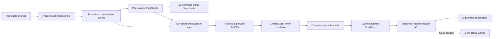

# Architecture

## Product boundary

The engine answers:

```text
Given this versioned product, ICP, goal, account state, and point in time:
which accounts are most likely to have a relevant opportunity, and is contact
now better than waiting or never contacting?
```

It does not claim purchase probability until real contact and sales outcomes
exist. Synthetic and public-event labels are explicitly marked R&D proxies.

## Flow



## Cost boundary

All monitored accounts receive deterministic consolidation and batch model
scoring. LLM narration is absent from universe-wide filtering. Account
StoryCards are generated only for delivered/on-demand accounts and are cached
by:

```text
account snapshot hash + product version + ICP version + provider version
```

The default narrator is deterministic and records zero LLM calls. A live
provider requires an explicit environment key, model selection, and nonzero
run budget.

## Different ICPs

World events and FactSheets are customer-independent and reusable. A run freezes
one product version, ICP version, goal version, and signal policy. The feature
builder then adds:

- hard/soft ICP fit;
- explicit `observed`, `not_observed`, `not_collected`, and `not_applicable`
  coverage;
- signal-specific sparse features;
- configurable ordered sequence features;
- goal/ICP-specific signal weights.

The same OSHA event can therefore be important for Sidekick, neutral for a lender,
and differently important for compliance software without changing the world
fact.

## Durable experiment protocol

The local DuckDB store owns immutable run requests, dense append-only event
sequences, benchmarks, recommendations, and StoryCard caches. A run freezes:

```text
corpus + source checksums + product + ICP + goal + signal policy
+ feature/model versions + as-of timestamp + seed + capacity + LLM budget
```

The web client consumes resumable SSE and displays structured execution,
evidence, counts, costs, model factors, and decisions. It does not display or
depend on hidden chain-of-thought.
